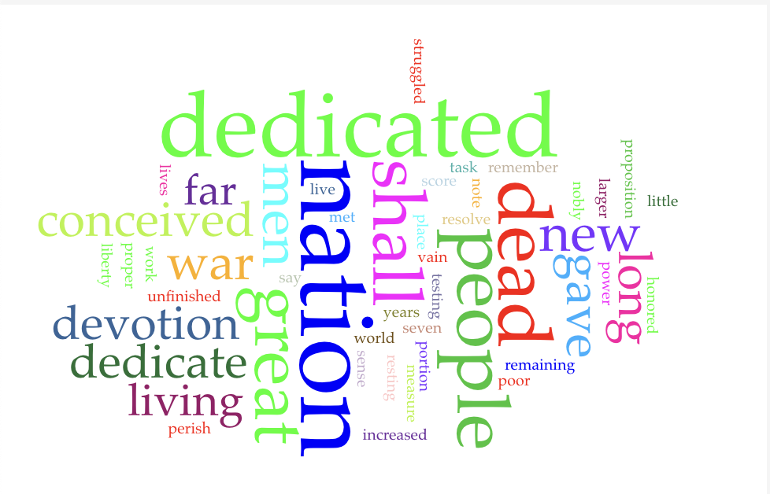



# Distant Reading Assignment 

For this project, I analyzed Abraham Lincoln's Gettysburg Address using Voyant Tools and Microsoft CoPilot.

## Voyant Analysis

I used Voyant to look at word frequency and patterns in the Gettysburg Address. The visualization made it easier to see which words and ideas appear repeatedly in the speech. Some of the main ideas that stood out were the nation, the people, sacrifice, dedication, and freedom.

## CoPilot Analysis

I asked CoPilot:

**What are the main themes of Abraham Lincoln's Gettysburg Address, and what repeated words or ideas support those themes?**

CoPilot explained that the speech focuses on national unity, sacrifice, equality, and continuing the work of the people who died during the Civil War. It also connected repeated ideas about dedication and the nation to the overall purpose of the speech.

I also asked:

**What can a word-frequency analysis tell us about the Gettysburg Address, and what might it miss?**

CoPilot explained that word frequency can help identify repeated ideas and patterns, but it cannot completely explain tone, historical context, symbolism, or why certain words were used.

## Reflection

Using Voyant and CoPilot showed me two different ways of analyzing the same text. Voyant was useful because it quickly showed repeated words and patterns that might not be as obvious when reading normally. CoPilot was more useful for explaining what those patterns could mean and connecting them to the larger message of the speech. At the same time, both tools have limitations. Voyant can show how often words appear, but it cannot fully explain why those words are important. CoPilot can give an interpretation, but its answers can still be too general or inaccurate, so the information should be checked. This exercise showed me that distant reading can be useful for finding patterns, but actually reading and understanding the context of the text is still important.
